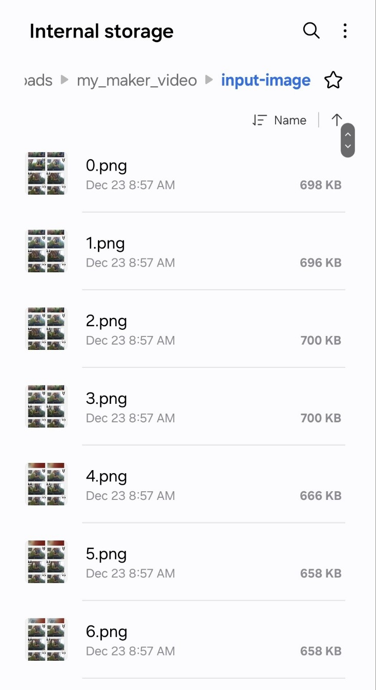

# MyMakerVideo

Effortlessly create videos from a sequence of images, add watermarks to videos with precise positioning, reduce video quality to optimize file sizes, and convert videos into high-quality GIFs. MyMakerVideo streamlines these tasks for your Flutter projects with powerful, fast, and customizable functionality.
## Installation

Add the following dependency to your `pubspec.yaml` file:

```yaml
my_maker_video: ^latest_version
```

Then, run the following command:

```bash
flutter pub get
```

### Android Configuration
Add the following configuration to your `android/app/build.gradle` file:

```gradle
defaultConfig {
    applicationId = "com.wongcoupon.my_maker_video.my_maker_video_example"
    // Update these values as needed for your application.
    minSdk = 24
    targetSdk = flutter.targetSdkVersion
    versionCode = flutter.versionCode
    versionName = flutter.versionName
}
```

Add these permissions to your `AndroidManifest.xml` file:

```xml
<uses-permission android:name="android.permission.WRITE_EXTERNAL_STORAGE"/>
<uses-permission android:name="android.permission.READ_EXTERNAL_STORAGE"/>
<uses-permission android:name="android.permission.READ_MEDIA_IMAGES"/>
<uses-permission android:name="android.permission.MANAGE_EXTERNAL_STORAGE"/>
```

### iOS Configuration
Add the following keys to your `Info.plist` file:

```xml
<key>NSPhotoLibraryUsageDescription</key>
<string>We need access to your photo library to pick files.</string>
<key>NSDocumentDirectoryUsageDescription</key>
<string>We need access to your documents to pick files.</string>
<key>UIFileSharingEnabled</key>
<true/>
<key>LSSupportsOpeningDocumentsInPlace</key>
<true/>
```

Ensure the platform version in your `ios/Podfile` is set to:

```ruby
platform :ios, '13.0'
```

## Usage

Import the package:

```dart
import 'package:my_maker_video/my_maker_video.dart';
```

### Permissions
Ensure that your app has the required write permissions.

### Features

#### 1. Create a Video from a Sequence of Images
Ensure that the `path/to/images` directory contains images named with natural numbers and `.png` format, as shown in the example:



The `path/to/videoOutput.mp4` must have a unique name to avoid overwriting existing files.

```dart
final result = MyMakerVideo.ffmpegKit.convertImageDirectoryToVideo(
    imagesPath: "path/to/images",
    outputVideoPath: "path/to/videoOutput.mp4",
    // fps: 2
);
```

> **Note:** If the video is large, please allow some time for processing.

#### 2. Add a Watermark to a Video

```dart
final result = MyMakerVideo.ffmpegKit.addWatermarkToVideo(
    watermarkPath: watermarkPath!, // Path to the watermark image or video
    videoPath: videoPath!,         // Path to the video to watermark
    outputPath: pathVideo,         // Path to save the output video
    x: 20,                         // X-coordinate (top-left origin)
    y: 30,                         // Y-coordinate
    width: 200,                    // Width of the watermark
    height: 200                    // Height of the watermark
);
```

#### 3. Reduce Video Quality

```dart
final result = MyMakerVideo.ffmpegKit.reduceVideoQualityByPercentage(
    inputPath: videoPath!,        // Path to the input video
    outputPath: pathVideo,        // Path to save the output video
    qualityPercentage: 30         // Percentage to reduce quality
);
```

#### 4. Create a GIF from a Video

```dart
final result = MyMakerVideo.ffmpegKit.createGifFromVideo(
    inputPath: videoPath!,        // Path to the input video
    outputPath: pathGif,          // Path to save the output GIF
    quality: 100,                 // Quality of the GIF
    scale: 3200,                  // Scale of the GIF
    fps: 2,                       // Frames per second
);
```

To learn more about what I've done in the plugin, please check out my article 
[https://wongcoupon.com/en/doc/help/flutter/comprehensive-guide-to-video-processing-in-flutter-using-ffmpeg](https://wongcoupon.com/en/doc/help/flutter/comprehensive-guide-to-video-processing-in-flutter-using-ffmpeg)
[https://wong-coupon.gitbook.io/flutter/media/ffmpeg-flutter](https://wong-coupon.gitbook.io/flutter/media/ffmpeg-flutter)

## Developer Team
For any comments or feedback, please contact us:
- [ThaoDoan](https://github.com/mia140602)
- [DucNguyen](https://github.com/ngmduc2012)

[Buy Us A Coffee ❤️](https://buymeacoffee.com/ducmng12g) | [Support Us on Ko-fi ❤️](https://ko-fi.com/I2I81AEJG8)

